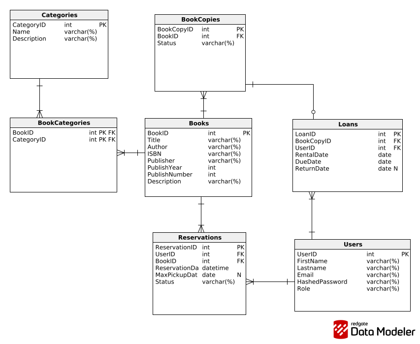
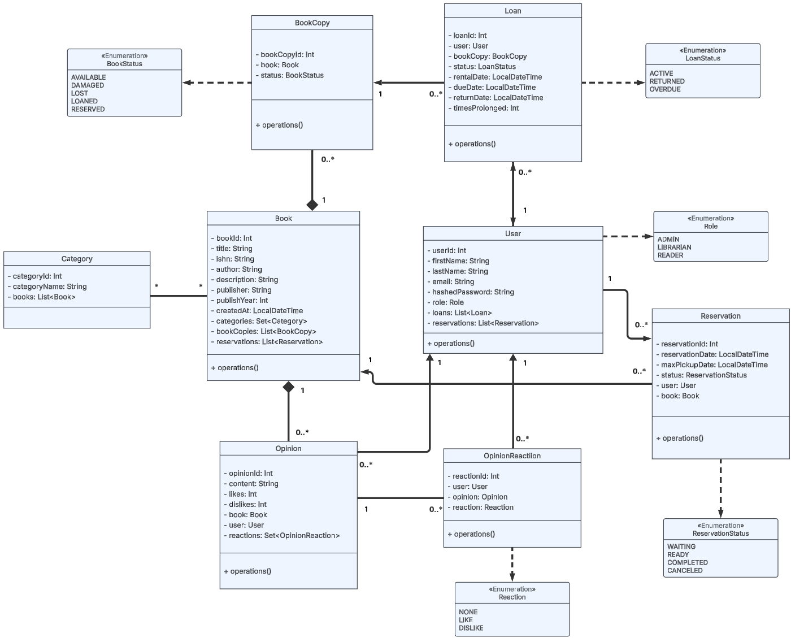

# Dokumentacja Library-System

## Użyte Technologie
* Java
* Spring

## Model bazodanowy

## Model obiektowy

### User
Klasa przedstawiająca użytkowników biblioteki, w tym bibliotekarzy i adminów

### Role
Enumerator dostępnych ról użytkowników

### Category
Przedstawia kategorie, rodzaje i gatunki książek dostępnych w bibliotece

### Book
Przedstawia książki dostępne w bibliotece, ich tytuły, autorów oraz inne informacje istotne dla czytelników

### BookCopy
Przedstawia indywidualne egzemplarze książek, które biblioteka ma w magazynie oraz ich stan

### BookStatus
Enumerator - stan egzemplarza książki

### Loan
Klasa przedstawia pożyczkę książki przez danego użytkownika, jej daty pożyczenia oraz oddania jak również jej status. Historia wypożyczeń jest przechowywana do celów archiwalnych

### LoanStatus
Enumerator - status pożyczki

### Reservation
Przedstawia rezerwacje książek. Rezerwacje mogą być użyte gdy użytkownik chce pożyczyć książki które na ten moment nie są dostępne

### ReservationStatus
Enumerator - status rezerwacji

## Operacje CRUD dla użytkownika

### Dodawanie nowego użytkownika

### Pobieranie listy użytkowników

### Pobieranie pojedynczego użytkownika

### Edytowanie danych uzytkownika

### Usuwanie użytkownika

### Rejestracja użytkownika

### Logowanie użytkownika

## Wygląd i działanie aplikacji

### Strona główna

### Strona logowania

### Strona rejestracji

### Strona główna po poprawnym zalogowaniu

### Strona profilu użytkownika

